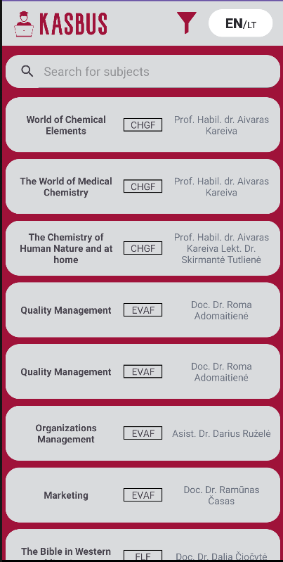

# KASBUS APP

IT Course Semester 2. OOP project. Android app. Not working anymore because the owner of the kasbus.lt website decided to stop the api endpoints. That was where we were getting all our data.

Four first year VU students from faculty of Mathematics and Informatics made this android app for the [kasbus.lt](https://kasbus.lt) website

We made the app using android studio, using Java.

The app uses an API made by kasbus.lt website to GET and POST data.

## Installation

To run the project download it and run it on android studio. It should work automatically.

We are adding it to google play but it may take some time.

## Documentation

All of the necessary data about subjects, lecturers and so on is received from [kasbus.lt](https://kasbus.lt) which created this API for us - [api-docs](http://api.kasbus.lt/api-docs/#/)

### Activities
Activities in android are similar to pages. You can start a new activity or end one. We have java files for implementation and xml files for design.

**`MainActivity`** is the page which is the first to launch. It has a loading screen that shows up until the data is received.

**`FilterActivity`** is the filter page. When a person closes the app and opens it again the selections are saved, but only called until you press on the filter and press done.

**`SubjectActivity`** is the specific subject page. This calls the GET API to receive comments and ratings. Until they show up their places are placed with question marks '?'. In this activity we also can use the POST API to comment and give ratings by clicking send button.

### API
The API folder contains all API calls. We used a library called Retrofit that allows us to asynchronously enqueue a call to the API which then calls a specific callback interface (GetCallback, SubjectCallback). These interfaces are implemented in the activity files.   There is also `APIInterface.java` file which stores all the ways we can call the API and what it requires. This is used to pass the call to the Retrofit enqueue function.

### Containers
The container folder has all of the structures necessary for storing API data.

### Filter
The selected values are stored in persistent storage called SharedPreferences. When you launch the app it does not use these filters only when you open the filter activity and press done, does it add the specified filter.

### Adapters
They are used by RecycleView container which can be populated with objects and then these are displayed according to a template.

`bus_template.xml` is the main page subject template  
`comment_template.xml` is the subject page comment template.

The templates respectively have `SubjectAdapter` and `CommentAdapter` which we use to populate data.

### Loading screen
Loading screen and retry loading screen is included in the main activity and when the data is received it just changes visibility to "gone", otherwise the retry screen pops up and you can try connecting again.

### Localization
This is achieved by putting all of our strings in strings.xml file and translating every string into its language.

When we want to use the locale, we just reload the app with specified language.

